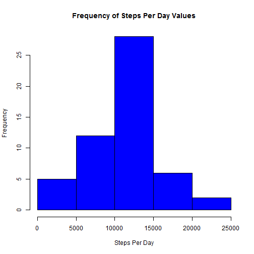
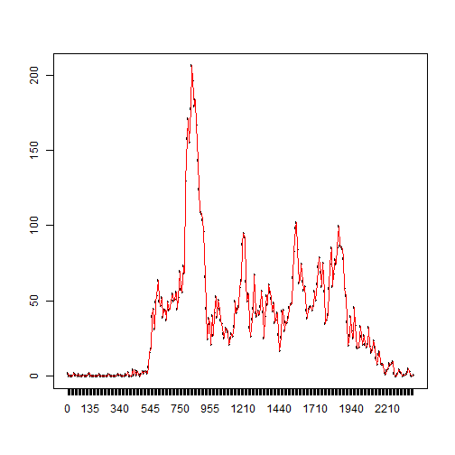
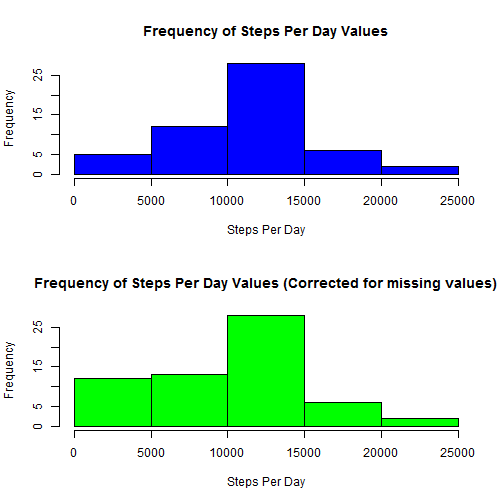
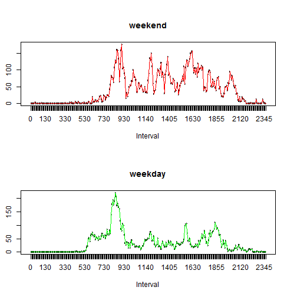

## Introduction
In this document we will analyze the data collected from a personal fitness device at five minute intervals over a period of 61 days extending from October 1st 2012 to November 30th 2012.  

We first study the average number of steps taken for each day creating a histogram of the values arrived at by taking the mean of each days steps over the study period.  We also report the mean and the median of the average number of steps per day. 
Secondly we plot the averge steps per interval over the study period and determine what interval has the maximum avg steps. We then examine the distribution of missing values in the data and examine one strategy for deriving approximations for values that are missing. Finally we compare the average steps per interval for weekdays vs. weekend days. 


## Loading and preprocessing the data

```r
## create frame of date values
data <- read.csv("activity.csv")
## create vector of date factors
datefactors <- unique(factor(data$date))
## create vector of interval values
intervalfactors <- unique(factor(data$interval))
## create vector of indices for dates
dateindices <- 1:length(datefactors)
## create vector of indices of intervals
intervalindices <- 1:length(intervalfactors)

## transform data into matrix with names for rows of the interval factors and names for columns of date factors
m <- matrix(data$steps, nrow = length(intervalfactors), ncol = length(datefactors), dimnames = list(intervalfactors, datefactors))
```

The data is provided as a data file that contains steps for each interval of each day recorded.
To facilitate our study the data is transformed into a matrix with each column representing a date
and each row represetning an interval during the day. The data represents a total of 61 dates 
between October 1st 2012 to November 30th 2012.  For each day recorded the day is divided into 
5 minute intervals labeled with the hour and the minute concatenated together into a string. 
There is a total of 288 five intervals in one day.  

## What is mean total number of steps taken per day?


```r
## calculate steps per day
stepsPerDay <- colSums(m)
## get the mean
meanStepsPerDay <- mean(stepsPerDay, na.rm = TRUE)
## get the median
medianStepsPerDay <- median(stepsPerDay, na.rm = TRUE)
```

### The following figure displays the frequency of different counts of steps per day.
 


#### The mean steps per day is     10766.19  
#### The median steps per day is 10765


## What is the average daily activity pattern?

```r
## get the average steps per interval
stepsPerInterval <- rowMeans(m, na.rm = TRUE)
## find the max
max <- max(stepsPerInterval)
## flag max interval factor
maxinterval <- stepsPerInterval == max
## get the max interval  name
maximumIntervalName <- intervalfactors[maxinterval]

## calculate the hour and minute correspondng to max interval
maxhour <- substr(maximumIntervalName, 1,1)## round(maxIntervalValue / 100)
maxminute <- substr(maximumIntervalName, 2,3)
```

#### Below we display a plot of the avg number of steps per interval over the period of dates studied.
 
<BR/>
Each plotted point represents the average value of steps over the study period for one three minute interval of the day starting at midnight and going to the next midnight.  The maximum steps per interval value is 206.1698113 which occurs at interval label 835 or 8:35 AM.

## Imputing missing values

```r
data <- m
dim(data) <- NULL
## count all the na's in the data
nascnt <- sum(is.na(data))
cnt <- length(data)
## get percent of na's
pcntNas <- round(nascnt/cnt * 100,2)
## flag all nas in matrix
nas <- is.na(m)
dim(nas) <- c(length(intervalfactors), length(datefactors))
## find na's by columns and by rows
nasByDate <- colSums(nas)
nasByInterval <- rowSums(nas)
## given knowledge that there are 288 na's in every column that has na's flag all columns with na's
flagNaDates <- nasByDate == 288
```

There are numerous NA values in the data,  the total number of items that contain an NA is 2304 items out of 17568 items which is 13.11% of the total.
Examining the distribution of NA's by date we find the following distribution of counts [288, 0]. Conversely examining the distribution by interval we find the following distributions of counts [8].  Since there are 288 intervals reported in each day we can infer that there are 8 days that contain nothing but all NA values.  The following dates consist of nothing but Na's:  

[2012-10-01, 2012-10-08, 2012-11-01, 2012-11-04, 2012-11-09, 2012-11-10, 2012-11-14, 2012-11-30].  

One strategy would be to take the average of adjoining dates for the missing data, however this would fail for Nov 9th and Nov 10th of 2012 where there are two adjoining columns with nothing but NA's. There are also problems with the fact that the first and last columns also consist of nothing but NA's which means we can only use one adjoining column of data to infer a value.  We therefore have three strategies for imputing values to missing data.  If only one adjoining column has data we use the existing column. These will be called the 'right' and 'left' strategies, if both adjoining columns have values then we shall take the average of both adjoining columns.  This strategy will be called the 'avg' strategy.  Therefore we will correct the values in the missing columns by applying the strategies to each column with missing data in this fashion.

* Date-----------Strategy
* 2012-10-01      left
* 2012-10-08       avg
* 2012-11-01       avg
* 2012-11-04       avg
* 2012-11-09     right
* 2012-11-10      left
* 2012-11-14       avg
* 2012-11-30     right


```r
## implement function for each strategy
left <- function(m, i) {
  m[,datefactors[i]] <- m[,datefactors[i - 1]]
  m
}

right <- function(m, i) {
  m[,datefactors[i]] <- m[,datefactors[i + 1]]
  m
}

avg <- function(m,i){
     m[,datefactors[i]] < ceiling((m[,datefactors[i - 1]] + m[,datefactors[i + 1]])/2)
     m
 }


requiredindexes <- datefactors %in% datefactors[flagNaDates]

## display columns that need patching
dateindices[requiredindexes]
```

```
## [1]  1  8 32 35 40 41 45 61
```

```r
## apply patching functions
m2 <- right(m,1)
m2 <- avg(m2,8)
m2 <- avg(m2,32)
m2 <- avg(m2, 35)
m2 <- left(m2, 40)
m2 <- avg(m2, 41)
m2 <- avg(m2, 45)
m2 <- left(m2, 61)

## recalculate steps per day statistics
stepsPerDay2 <- colSums(m2, na.rm = TRUE)
meanStepsPerDay2 <- round(mean(stepsPerDay2), 2)
medianStepsPerDay2 <- median(stepsPerDay2)
```

 

There seems to be only slight differences between the two histograms with the heights of the first two columns being larger in relative size.  
For the corrected data. The median value for the corrected data and the original data are the same, while the mean value for the corrected data versus the original data is slightly lower. This is probably due to the fact that many of the imputed values are 0's.

#### The mean steps per day (corrected) is 9524.59 and the 
#### The median steps per day (corrected) is 10395

## Are there differences in activity patterns between weekdays and weekends?
We create two sets of data one for the weekdays and one for the weekend days and plot the steps per interval for weekdays and weekend days.  The figure below presents this data. We present this calculation in the code block below and below that the requisite plots.

```r
## create discrimination function for flagging weekend days
weekend <- function(str) {
  if (str == 'Monday') return(FALSE)
  if (str == 'Tuesday') return(FALSE)
  if (str == 'Wednesday') return(FALSE)
  if (str == 'Thursday') return(FALSE)
  if (str == 'Friday') return(FALSE)
  if (str == 'Saturday') return(TRUE)
  if (str == 'Sunday') return(TRUE)
  stop("Invalid weekday [", str, "]")
}

## Create factors for weekends and weekdays
daynames <- (weekdays(as.Date(datefactors)))
## flag weekend days
weekenddays <- sapply(daynames, weekend)
## flag week days
weekdays <- !weekenddays

## Extract data subsets
weekenddata <- m2[,weekenddays]
weekdaydata <- m2[,weekdays]

## find means for each interval in each subset
meanStepsPerWeekdayInterval <- rowMeans(weekdaydata, na.rm = TRUE)
meanStepsPerWeekendInterval <- rowMeans(weekenddata, na.rm = TRUE)
```


 
<BR/>
Comparing the two plots we see that the most noticable differences are that the maximum avg steps per interval is larger for the week day data while the week end data has more activity during the afternoon and evening intervals.  Conversely the week day data indicates that the average number of steps is greater for early morning intervals.

##Conclusions
There are days when it seems that the device is not collecting data. Presumably these are days that the user did not turn the device on. For the most part there is a peak of activity around the time 8:35 AM.  In general on week days there is more activity early in the morning while on weekends there is more activity in the afternoon. Peak activity is higher for weekdays than for weekends. 

